El flujo básico de Bold empieza con pocos datos maestros y termina con una orden de fabricación ejecutada en planta. El objetivo no es configurar toda la empresa. El objetivo es comprobar que un pedido puede convertirse en trabajo real y trazable.

Usa un producto común. Por ejemplo, **Mesa Nórdica - 160 cm - Roble**. Mantén el caso corto para que el equipo vea el recorrido antes de añadir variantes, controles, turnos, costes o reglas avanzadas.

## Recorrido recomendado

<Steps>
  <Step title="Crea el catálogo">
    Define productos y artículos. Añade propiedades si necesitas variantes como color, medida, material o acabado.
  </Step>
  <Step title="Prepara el almacén">
    Crea ubicaciones y decide qué artículos trabajan con lotes. Esto permite registrar recepciones, movimientos, inventarios y envíos con trazabilidad.
  </Step>
  <Step title="Registra demanda">
    Crea pedidos de venta o demandas internas. Al confirmar una línea, Bold la tiene en cuenta en el stock disponible y en el stock proyectado.
  </Step>
  <Step title="Planifica suministro">
    Revisa qué comprar y qué fabricar. Las recomendaciones no son compromisos hasta que creas pedidos, peticiones u órdenes.
  </Step>
  <Step title="Ejecuta compras o fabricación">
    Recibe compras en almacén, lanza órdenes de fabricación y registra consumos, operaciones y producción.
  </Step>
  <Step title="Entrega al cliente">
    Prepara el envío, selecciona stock y expide. El envío reduce stock y deja trazabilidad del pedido atendido.
  </Step>
</Steps>

<Steps>
  <Step title="Crea el catálogo mínimo">
    Crea el producto, el artículo terminado y los componentes que quieras consumir durante la fabricación. Marca el artículo terminado como fabricable.
  </Step>
  <Step title="Crea empleados">
    Añade al menos un empleado operativo. Lo usarás para registrar quién trabaja en **Modo de trabajo**.
  </Step>
  <Step title="Crea recursos de producción">
    Define un proceso y una estación, máquina, línea o puesto compatible con la operación que vas a ejecutar.
  </Step>
  <Step title="Configura una receta mínima">
    Crea una versión de receta para el producto. Añade una operación principal, las entradas necesarias y la salida del artículo terminado. Activa la versión.
  </Step>
  <Step title="Crea y confirma el pedido">
    Registra un pedido de venta con el artículo fabricado. Confirma la línea para que genere demanda.
  </Step>
  <Step title="Lanza la OF">
    Revisa la necesidad de fabricación, crea una petición si corresponde y genera una orden de fabricación con la receta activa.
  </Step>
  <Step title="Ejecuta en planta">
    Entra en **Modo de trabajo**, selecciona el empleado, inicia la operación, registra avance, consume material si aplica y finaliza la OF.
  </Step>
</Steps>

## Cómo se conecta

```mermaid
flowchart LR
  catalogo["Catálogo<br/>producto, artículo y componentes"] --> personas["Empleado<br/>registro operativo"]
  personas --> recursos["Recurso<br/>estación compatible"]
  recursos --> receta["Receta activa<br/>operaciones y entradas"]
  receta --> pedido["Pedido de venta<br/>línea confirmada"]
  pedido --> demanda["Demanda<br/>cantidad y fecha"]
  demanda --> peticion["Petición de fabricación<br/>qué falta"]
  peticion --> of["OF<br/>cómo se fabrica"]
  of --> ejecucion["Modo de trabajo<br/>ejecución y trazabilidad"]
  ejecucion --> stock["Stock producido<br/>artículo terminado"]
  stock -. opcional .-> envio["Envío<br/>salida al cliente"]
```

El pedido explica la demanda. La petición de fabricación explica qué falta fabricar. La OF explica cómo se ejecutará el trabajo en planta.

## Qué debe quedar validado

| Área | Resultado esperado |
| --- | --- |
| Catálogo | El producto y el artículo terminado se usan en pedido, receta y OF. |
| Personal | El empleado aparece en **Modo de trabajo** y queda asociado al registro operativo. |
| Recursos | La operación puede ejecutarse en una estación o recurso compatible. |
| Receta | La versión activa copia operaciones, entradas y salidas a la OF. |
| Pedido | La línea confirmada genera demanda para el artículo fabricado. |
| Fabricación | La OF registra avance, consumos, producción y cierre. |

<Warning>
  Una línea de pedido en borrador no genera demanda. Confirma la línea cuando quieras que planificación y fabricación la tengan en cuenta.
</Warning>

## Expedición opcional

Para este punto ya habrás visto el flujo principal: pedido, necesidad, OF y ejecución. Si quieres cerrar el ciclo completo, prepara y registra el envío cuando la OF haya generado stock disponible.

<Card title="Preparar y registrar un envío" icon="truck" href="/es/ayuda/ventas/preparar-y-registrar-envio">
  Expide el pedido y valida la salida de stock cuando quieras probar también logística.
</Card>

## Siguientes páginas

<Columns cols={2}>
  <Card title="Preparar datos base" icon="database" href="/es/ayuda/primeros-pasos/preparar-datos-base">
    Crea el catálogo, empleados y recursos mínimos para el primer caso.
  </Card>

  <Card title="Configurar una receta mínima" icon="book-open" href="/es/ayuda/primeros-pasos/configurar-receta-minima">
    Prepara una receta corta para el producto que vas a fabricar.
  </Card>

  <Card title="Crear pedido y lanzar OF" icon="clipboard-list" href="/es/ayuda/primeros-pasos/crear-pedido-y-lanzar-of">
    Convierte una demanda confirmada en una orden de fabricación.
  </Card>

  <Card title="Ejecutar la primera OF" icon="play" href="/es/ayuda/primeros-pasos/ejecutar-primera-of">
    Registra ejecución, consumos y producción desde planta.
  </Card>
</Columns>

## Relacionado

- [Qué es Bold](/es/conceptos/introduccion)
- [Demanda y suministro](/es/conceptos/planificacion/demanda-y-suministro)
- [Peticiones de fabricación](/es/conceptos/fabricacion/peticiones-de-fabricacion)