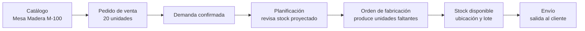

El flujo básico de Bold empieza con datos maestros y termina con movimientos trazables. Puedes usar solo una parte del ciclo, pero el mayor valor aparece cuando ventas, planificación, compras, almacén y producción comparten los mismos artículos.

## Recorrido recomendado

<Steps>
  <Step title="Crea el catálogo">
    Define productos y artículos. Añade propiedades si necesitas variantes como color, medida, material o acabado.
  </Step>
  <Step title="Prepara el almacén">
    Crea ubicaciones y decide qué artículos trabajan con lotes. Esto permite registrar recepciones, movimientos, inventarios y envíos con trazabilidad.
  </Step>
  <Step title="Registra demanda">
    Crea pedidos de venta o demandas internas. Al confirmar una línea, Bold la tiene en cuenta en el stock disponible y en el stock proyectado.
  </Step>
  <Step title="Planifica suministro">
    Revisa qué comprar y qué fabricar. Las recomendaciones no son compromisos hasta que creas pedidos, peticiones u órdenes.
  </Step>
  <Step title="Ejecuta compras o fabricación">
    Recibe compras en almacén, lanza órdenes de fabricación y registra consumos, operaciones y producción.
  </Step>
  <Step title="Entrega al cliente">
    Prepara el envío, selecciona stock y expide. El envío reduce stock y deja trazabilidad del pedido atendido.
  </Step>
</Steps>

## Qué cambia el stock

El stock físico cambia por movimientos reales. Las previsiones ayudan a decidir, pero no reemplazan la ejecución.

| Acción | Efecto principal |
| --- | --- |
| Recibir material | Aumenta stock en una ubicación y lote. |
| Expedir un envío | Reduce stock en una ubicación y lote. |
| Ajustar stock | Corrige una diferencia puntual. |
| Hacer inventario | Regulariza el stock según el recuento físico. |
| Consumir componentes | Reduce stock durante fabricación. |
| Registrar producción | Aumenta stock del artículo fabricado. |

## Qué crea demanda o suministro

<Columns cols={2}>
  <Card title="Demanda" icon="arrow-down-to-line">
    Una línea confirmada de pedido de venta descuenta disponibilidad y aparece en planificación.
  </Card>
  <Card title="Suministro" icon="arrow-up-from-line">
    Una línea confirmada de pedido de compra, una petición de fabricación o una orden de fabricación puede cubrir necesidades futuras.
  </Card>
</Columns>

<Warning>
  Una línea en borrador no genera compromiso operativo. Confirma las líneas cuando quieras que afecten a planificación.
</Warning>

## Ejemplo con un pedido

Una fábrica recibe un pedido de **Cliente ACME** para 20 unidades de **Mesa Madera M-100**. Bold usa el mismo artículo durante todo el flujo: venta, planificación, fabricación, almacén y envío.

En este ejemplo, el pedido de venta crea demanda al confirmar la línea. Si no hay stock suficiente, planificación muestra la necesidad. La fabricación registra consumos y producción. El envío reduce stock físico cuando se expide.

## Primer flujo de prueba

Para validar una configuración inicial, usa un ejemplo pequeño:

1. Crea un producto y un artículo terminado.
2. Crea una ubicación de almacén.
3. Ajusta stock inicial o recibe material.
4. Crea un pedido de venta con ese artículo.
5. Confirma la línea y revisa el stock disponible.
6. Crea un envío desde el pedido y expídelo.

Cuando ese recorrido funcione, añade recetas, componentes y órdenes de fabricación.

## Relacionado

- [Qué es Bold](/conceptos/introduccion)
- [Conceptos de Bold](/conceptos/introduccion)
