Primeros pasos te guía por el recorrido mínimo para usar Bold: prepara los datos base, define cómo se fabrica un producto habitual, crea un pedido, conviértelo en una orden de fabricación y registra su ejecución.

Empieza con un caso pequeño. Usa un producto habitual, una receta corta, un empleado operativo y un recurso de producción. Después amplía catálogo, permisos, ubicaciones y controles.

## Flujo operativo

<Steps>
  <Step title="Prepara el catálogo y el almacén">
    Crea la familia, el artículo terminado y los componentes que quieras consumir. Añade una ubicación si vas a registrar consumos o producción con stock. Decide si necesitas trazabilidad por lotes.
  </Step>
  <Step title="Registra la demanda">
    Crea un pedido de venta con el artículo fabricado. Confirma la línea para que Bold la tenga en cuenta en planificación.
  </Step>
  <Step title="Planifica el suministro">
    Revisa qué debes comprar y fabricar. Las recomendaciones no son compromisos hasta que creas pedidos, peticiones u órdenes.
  </Step>
  <Step title="Ejecuta compras o fabricación">
    Recibe las compras necesarias, lanza la OF y registra operaciones, consumos y producción.
  </Step>
  <Step title="Entrega al cliente">
    Cuando exista stock disponible, prepara el envío y registra la expedición para cerrar el ciclo.
  </Step>
</Steps>

## Primera prueba guiada

<Steps>
  <Step title="Prepara los datos base">
    Crea el catálogo, al menos un empleado operativo y los recursos de producción mínimos. Usa un producto que el equipo reconozca.
  </Step>
  <Step title="Configura la receta">
    Define una versión simple con una operación principal, las entradas necesarias y la salida del artículo terminado. Activa la versión.
  </Step>
  <Step title="Crea y confirma el pedido">
    Registra un pedido de venta con el artículo fabricado. Confirma la línea para que genere demanda.
  </Step>
  <Step title="Lanza la OF">
    Revisa la necesidad de fabricación, crea una petición si corresponde y genera la OF con la receta activa.
  </Step>
  <Step title="Ejecuta en planta">
    Entra en **Modo de trabajo**, selecciona el empleado, inicia la operación, registra avance y consumos, y finaliza la OF.
  </Step>
</Steps>

## Cómo se conecta

```mermaid
flowchart LR
  catalogo["Catálogo<br/>producto, artículo y componentes"] --> personas["Empleado<br/>registro operativo"]
  personas --> recursos["Recurso<br/>estación compatible"]
  recursos --> receta["Receta activa<br/>operaciones y entradas"]
  receta --> pedido["Pedido de venta<br/>línea confirmada"]
  pedido --> demanda["Demanda<br/>cantidad y fecha"]
  demanda --> peticion["Petición de fabricación<br/>qué falta"]
  peticion --> of["OF<br/>cómo se fabrica"]
  of --> ejecucion["Modo de trabajo<br/>ejecución y trazabilidad"]
  ejecucion --> stock["Stock producido<br/>artículo terminado"]
  stock -. opcional .-> envio["Envío<br/>salida al cliente"]
```

El pedido explica la demanda. La petición de fabricación explica qué falta fabricar. La OF explica cómo se ejecutará el trabajo en planta.

<Warning>
  Una línea de pedido en borrador no genera demanda. Confirma la línea cuando quieras que planificación y fabricación la tengan en cuenta.
</Warning>

## Qué debe quedar validado

| Área | Resultado esperado |
| --- | --- |
| Catálogo | La familia y el artículo terminado se usan en pedido, receta y OF. |
| Personal | El empleado aparece en **Modo de trabajo** y queda asociado al registro operativo. |
| Recursos | La operación puede ejecutarse en una estación o recurso compatible. |
| Receta | La versión activa copia operaciones, entradas y salidas a la OF. |
| Pedido | La línea confirmada genera demanda para el artículo fabricado. |
| Fabricación | La OF registra avance, consumos, producción y cierre. |

## Completa el recorrido

<Columns cols={2}>
  <Card title="Preparar datos base" icon="database" href="/es/ayuda/primeros-pasos/preparar-datos-base">
    Crea el catálogo, los empleados y los recursos mínimos para el primer caso.
  </Card>

  <Card title="Definir un proceso de fabricación" icon="book-open" href="/es/ayuda/primeros-pasos/configurar-receta-minima">
    Prepara una receta corta para el producto que vas a fabricar.
  </Card>

  <Card title="Crear un pedido y lanzar una OF" icon="clipboard-list" href="/es/ayuda/primeros-pasos/crear-pedido-y-lanzar-of">
    Convierte una demanda confirmada en una orden de fabricación.
  </Card>

  <Card title="Ejecutar la primera OF" icon="play" href="/es/ayuda/primeros-pasos/ejecutar-primera-of">
    Registra ejecución, consumos y producción desde planta.
  </Card>

  <Card title="Preparar y registrar un envío" icon="truck" href="/es/ayuda/ventas/preparar-y-registrar-envio">
    Expide el pedido cuando quieras validar también la salida de stock.
  </Card>

  <Card title="Entender Bold" icon="book-open" href="/es/conceptos/introduccion">
    Consulta conceptos cuando necesites entender un término antes de seguir.
  </Card>
</Columns>

## Qué dejar para después

No necesitas configurar toda la fábrica antes de validar el flujo. Añade estos elementos cuando el primer recorrido ya funcione.

| Elemento | Cuándo añadirlo |
| --- | --- |
| Catálogo completo | Cuando el equipo haya validado cómo modelar productos y artículos. |
| Perfiles detallados | Cuando sepas qué acciones hará cada responsabilidad. |
| Lotes, bultos y contenedores | Cuando necesites trazabilidad física o preparación logística. |
| Controles de calidad complejos | Cuando la receta mínima ya genere operaciones ejecutables. |
| Costes y cuadros de mando | Cuando los datos de ejecución sean estables. |

## Relacionado

- [Demanda y suministro](/es/conceptos/planificacion/demanda-y-suministro)
- [Peticiones de fabricación](/es/conceptos/fabricacion/peticiones-de-fabricacion)
