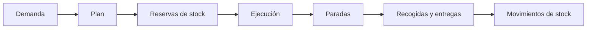
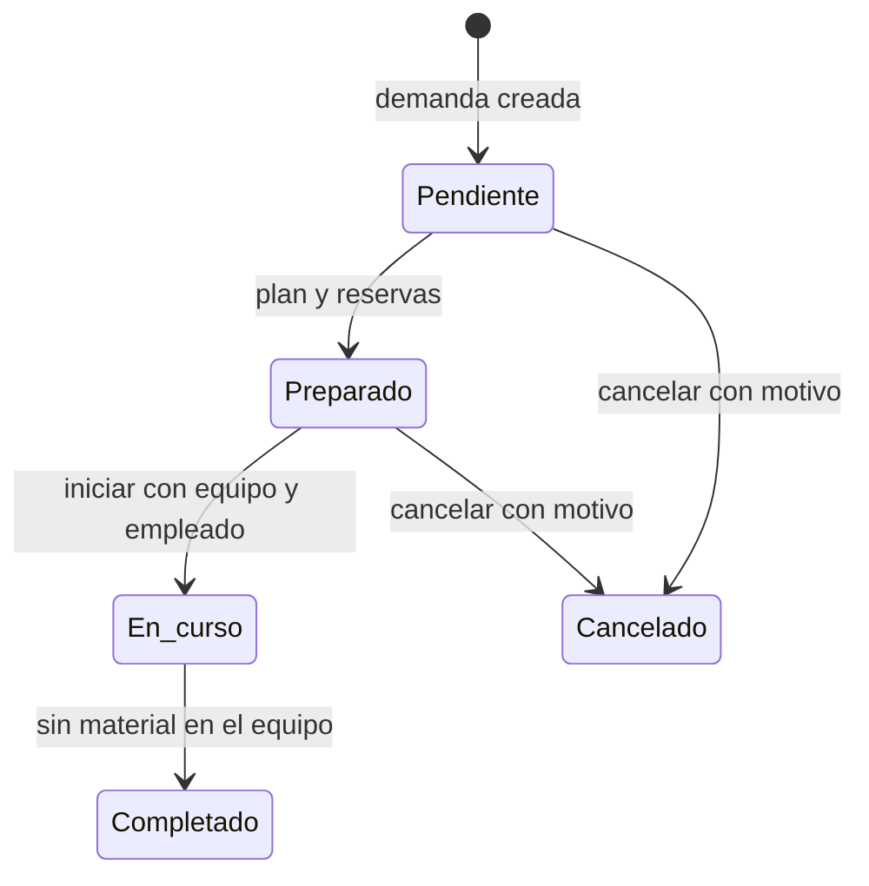

Un **movimiento operativo de almacén** es una tarea para recoger material en una o varias ubicaciones y dejarlo en un destino.

No es lo mismo que un [movimiento de stock](/es/conceptos/almacen/stock-y-movimientos). La tarea operativa dirige el trabajo físico. Los movimientos de stock son los registros que auditan cada recogida y entrega.

## Tipos de movimiento

| Tipo | Cuándo se crea | Destino |
| --- | --- | --- |
| **Preparación** | Una orden de carga solicita material que no está listo. | Ubicación de carga. |
| **Aprovisionamiento** | Una operación de fabricación solicita entradas que no están en la estación. | Ubicación de consumo de la estación. |
| **Almacenamiento** | Un empleado crea un movimiento libre desde el modo de trabajo. | Ubicación elegida durante la ejecución. |

Los movimientos de **Preparación** y **Aprovisionamiento** nacen de una demanda. Bold calcula qué recoger, en qué ubicación y en qué orden. Un movimiento de **Almacenamiento** empieza sin demanda ni plan: el empleado elige el origen, el material y el destino.

## Modelo del movimiento

| Parte | Qué contiene |
| --- | --- |
| Demanda | Destino, artículos o bultos, cantidades y documento de origen. |
| Plan | Paradas ordenadas y acciones de recogida o entrega. |
| Reservas | Stock apartado para que otra tarea no lo asigne antes. |
| Ejecución | Equipo, empleado, hora de inicio y finalización. |
| Paradas | Llegadas y salidas de cada ubicación. |
| Acciones | Artículo, lote, bulto, cantidad y momento de cada recogida o entrega. |

## Cómo planifica Bold

Bold descuenta las reservas existentes antes de elegir stock. Si la demanda no fija un lote, puede seleccionar uno disponible. Si fija un lote, debe respetarlo.

El plan agrupa las recogidas por ubicación. Ordena primero los orígenes y deja el destino para el final. Cada acción queda reservada hasta que se ejecuta, se cancela o deja de ser necesaria.

Si solo hay stock para una parte de la demanda, Bold prepara un movimiento para esa parte y deja el resto en otro movimiento pendiente. Así puedes trasladar lo disponible sin perder la necesidad restante.

## Estados y ciclo de vida

| Estado | Significado |
| --- | --- |
| **Pendiente** | Existe demanda, pero todavía no hay un plan ejecutable para todo o parte del material. |
| **Preparado** | Tiene plan y reservas, o es un movimiento libre listo para empezar. |
| **En curso** | Un empleado lo está ejecutando con un equipo de almacén. |
| **Completado** | Todo el material recogido se ha dejado y la tarea se cerró. |
| **Cancelado** | Se anuló antes de empezar y se liberaron sus reservas. |

Un movimiento no puede completarse mientras el equipo todavía transporte stock o bultos. Tampoco se puede cancelar después de iniciar la ejecución.

## Incidencias de planificación

Un movimiento pendiente puede mostrar una incidencia:

| Incidencia | Qué significa | Qué revisar |
| --- | --- | --- |
| **Stock insuficiente** | No hay cantidad libre suficiente para crear el plan. | Stock físico, ubicación, lote y reservas. |
| **Bulto solicitado no disponible** | El bulto no existe, está reservado o no está disponible. | Ubicación y estado del bulto. |
| **El contenido del bulto no coincide** | El bulto no contiene el artículo, lote o cantidad solicitados. | Contenido registrado del bulto. |
| **Conflicto de reserva** | Otro proceso reservó el recurso durante la planificación. | Reservas y movimientos simultáneos. |

Bold vuelve a intentar planificar los movimientos pendientes cuando aumenta el stock correspondiente o se libera una reserva. La **Fecha límite** ordena primero las necesidades más próximas.

## Ejecución y stock en tránsito

Al empezar, el movimiento queda asignado a un solo [equipo de almacén](/es/conceptos/almacen/equipos-y-transportes). Un equipo no puede ejecutar dos movimientos a la vez.

Cada recogida traslada el stock a la ubicación interna del equipo. La vista **Carga actual** muestra el stock suelto y los bultos que transporta. Cada entrega mueve ese contenido desde el equipo hasta la ubicación de destino.

Para stock suelto, la ejecución conserva artículo, lote y cantidad. Para un bulto, mueve el bulto y todo su contenido registrado como una unidad.

## Demanda y reservas en destino

Antes de crear un movimiento, Bold reserva el stock que ya está en el destino. El movimiento solo cubre la cantidad restante.

Cuando el material llega, la reserva pasa a la línea que originó la demanda:

- una entrada de operación de fabricación;
- una línea de orden de carga.

Si cambian las cantidades requeridas antes de empezar, Bold puede cancelar movimientos todavía no ejecutados, liberar reservas y calcular otros nuevos.

## Relacionado

- [Aprovisionar materias primas](/es/ayuda/almacen/aprovisionar-materias-primas)
- [Preparar materiales para una carga](/es/ayuda/almacen/preparar-materiales-para-una-carga)
- [Mover stock](/es/ayuda/almacen/mover-stock)
- [Equipos de almacén y transportes](/es/conceptos/almacen/equipos-y-transportes)
- [Stock y movimientos](/es/conceptos/almacen/stock-y-movimientos)
