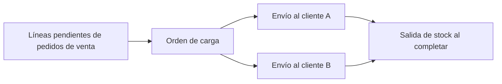
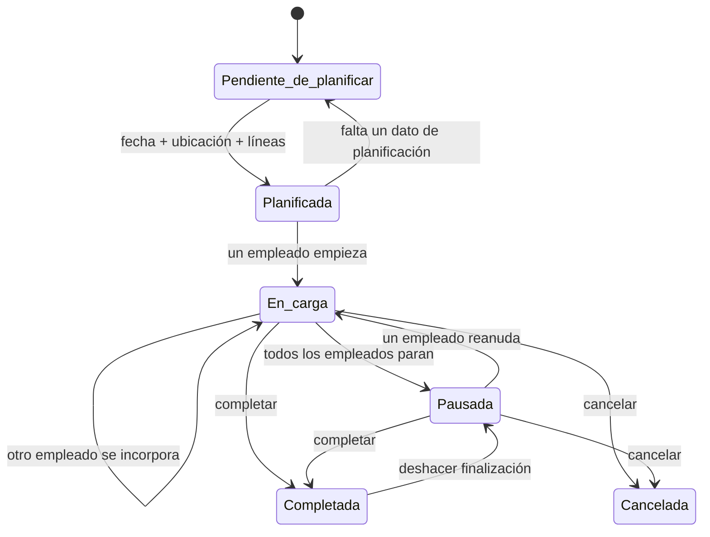

Una **orden de carga** agrupa la mercancía que vas a cargar en un transporte. Define qué líneas deben salir, cuándo se preparan y desde qué ubicación.

La orden de carga coordina el trabajo. Los [envíos](/es/conceptos/almacen/envios) siguen siendo los documentos que registran la salida física hacia cada destino.

## Elementos de una orden de carga

| Elemento | Uso |
| --- | --- |
| Transporte | Recurso logístico asignado a la carga. |
| Fecha y hora planificada | Momento previsto para preparar o cargar la mercancía. |
| Ubicación de carga | Ubicación de almacén donde debe quedar listo el material. |
| Líneas | Cantidades pendientes de líneas de pedidos de venta. |
| Envíos | Documentos de salida agrupados dentro de la carga. |
| Validación | Comprobación opcional de artículos, cantidades y lotes antes de completar. |
| Registros de tiempo | Periodos durante los que cada empleado trabaja en la carga. |

El transporte es obligatorio al crear la orden. La fecha, la ubicación y el nombre pueden completarse durante la planificación. Si dejas el nombre vacío, Bold genera uno a partir del transporte y, cuando aplica, de la fecha, el cliente, el pedido o el artículo.

## Relación con pedidos y envíos

Puedes añadir pedidos completos o líneas concretas. Bold solo ofrece líneas con cantidad todavía disponible para cargar.

Al incorporar una línea de pedido, Bold crea o reutiliza un envío para el mismo cliente dentro de la orden de carga. Una carga puede contener varios envíos cuando transporta mercancía para más de un destino.

## Estados de la orden

| Estado | Significado | Acciones habituales |
| --- | --- | --- |
| **Pendiente de planificar** | Falta fecha, ubicación de carga o al menos una línea. | Editar, añadir o retirar líneas y eliminar. |
| **Planificada** | Tiene fecha, ubicación de carga y líneas. | Solicitar materiales, editar, añadir o retirar líneas, eliminar o empezar. |
| **En carga** | Uno o varios empleados trabajan en la carga. | Validar, completar, cancelar o incorporar otro empleado. |
| **Pausada** | No queda ningún registro de tiempo activo. | Reanudar, completar o cancelar. |
| **Completada** | Los envíos se han expedido y la salida de stock está registrada. | Consultar o deshacer la finalización. |
| **Cancelada** | La carga iniciada se cerró sin completarse. | Consultar el histórico. |

La orden cambia automáticamente entre **Pendiente de planificar** y **Planificada** cuando completas o retiras la fecha, la ubicación o las líneas.

<Info>
  Después de empezar la carga, no puedes cambiar el transporte, la fecha, la ubicación ni la regla de validación. Puedes cambiar el nombre mientras la orden esté en carga o pausada.
</Info>

## Solicitud de materiales

La solicitud de materiales indica si Bold debe preparar stock en la ubicación de carga.

| Estado | Significado |
| --- | --- |
| **No solicitado** | Todavía no se ha iniciado el aprovisionamiento. |
| **Solicitado** | Bold ya puede reservar stock y crear movimientos para cubrir lo que falta. |

Al solicitar materiales, Bold actúa en este orden:

1. Reserva el stock que ya está disponible en la ubicación de carga.
2. Calcula la cantidad que falta por línea.
3. Crea [movimientos de preparación](/es/conceptos/almacen/movimientos-de-almacen) para trasladar la cantidad no cubierta.

Si el aprovisionamiento automático está activado, Bold solicita los materiales de las órdenes planificadas cuando entran en el plazo configurado en días laborables.

## Estados de aprovisionamiento

El estado global muestra la línea menos avanzada. La pestaña **Líneas** también muestra el estado, la cantidad **Lista** y la cantidad **En camino** de cada artículo.

| Estado | Significado |
| --- | --- |
| **Aprovisionamiento no solicitado** | La orden aún no ha solicitado materiales. |
| **Aprovisionamiento pendiente** | Está solicitado, pero no hay stock reservado ni un movimiento planificado que lo cubra. |
| **Aprovisionamiento en curso** | Hay parte del stock lista o en camino, pero queda cantidad sin cubrir. |
| **Aprovisionamiento planificado** | Todo está listo o cubierto por movimientos pendientes de ejecutar. |
| **Stock listo** | Todo el material está disponible en la ubicación de carga. |
| **No requiere aprovisionamiento** | La orden no tiene material pendiente que preparar. |

**Lista** es la cantidad ya disponible y reservada en la ubicación de carga. **En camino** es la cantidad cubierta por movimientos preparados o en curso.

## Validación de la carga

La validación registra qué cantidad se ha comprobado para cada envío y artículo. Puede incluir el lote y el bulto.

| Estado | Significado |
| --- | --- |
| **Sin validar** | No se ha validado ninguna cantidad. |
| **Validada parcialmente** | Se ha validado una parte de la cantidad requerida. |
| **Validada por completo** | Todas las líneas tienen validada su cantidad completa. |

Si la orden requiere validación, un empleado debe estar trabajando en la carga para validar. Bold no permite validar más cantidad de la requerida.

Al completar una carga con validación incompleta, puedes excluir las cantidades no validadas. Bold reduce o retira esas líneas también en los envíos. No puedes excluir todo si la orden quedaría vacía.

## Finalización, cancelación y reversión

Al completar la orden, Bold:

- finaliza los registros de tiempo activos;
- expide todos los envíos de la carga;
- reduce el stock de la ubicación de carga;
- conserva artículos, lotes, cantidades y empleados para trazabilidad.

Puedes completar desde **En carga** o **Pausada**. Puedes cancelar en esos mismos estados. Para retirar una orden que todavía no ha empezado, elimínala mientras esté pendiente de planificar o planificada.

Deshacer la finalización revierte los envíos asociados y devuelve la orden a **Pausada**. La reversión solo es posible si los envíos todavía coinciden con las líneas de la carga y se pueden revertir.

## Relacionado

- [Planificar una carga](/es/ayuda/almacen/planificar-una-carga)
- [Preparar materiales para una carga](/es/ayuda/almacen/preparar-materiales-para-una-carga)
- [Cargar y cerrar una expedición](/es/ayuda/almacen/cargar-y-cerrar-una-expedicion)
- [Movimientos de almacén](/es/conceptos/almacen/movimientos-de-almacen)
- [Envíos](/es/conceptos/almacen/envios)
