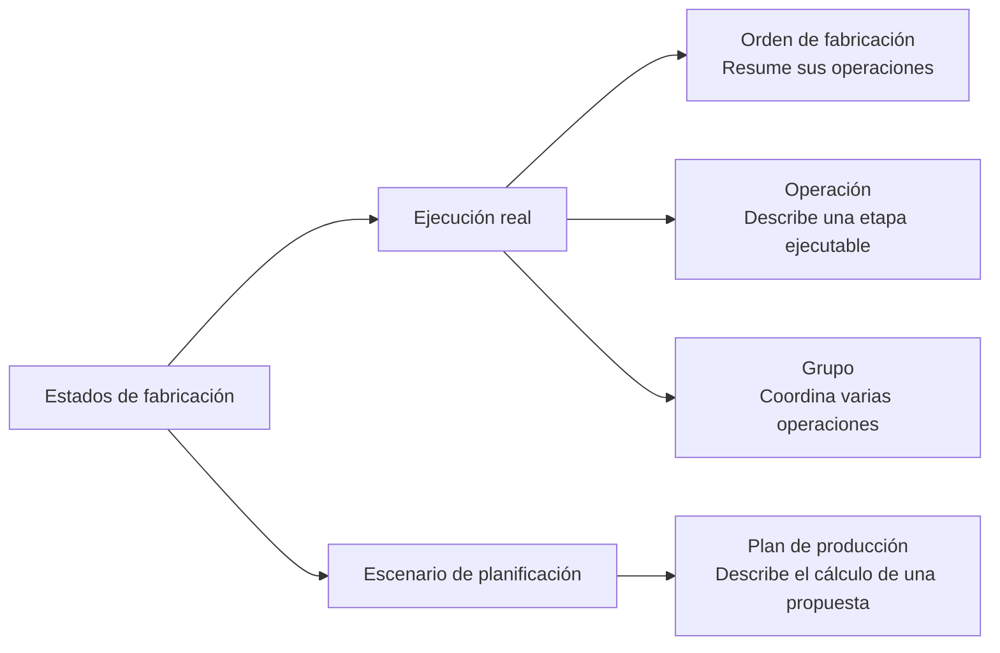

Los estados de fabricación indican si el trabajo está pendiente, preparado, en ejecución, detenido, terminado o cancelado.

Lee el estado junto con el objeto. Una orden, una operación, un grupo y un plan no cambian por las mismas acciones.

## Dos tipos de estado

| Objeto | Qué expresa su estado | Qué no implica |
| --- | --- | --- |
| Orden de fabricación | Situación global del trabajo ejecutable. | Que todas sus operaciones tengan el mismo estado. |
| Operación | Situación de una etapa concreta. | Que toda la orden haya alcanzado ese estado. |
| Grupo de operaciones | Situación del bloque operativo. | Que desaparezca el historial individual de sus operaciones. |
| Plan de producción | Situación del cálculo de una propuesta. | Que las operaciones reales hayan cambiado. |

<Tip>
  Un mismo término no siempre describe la misma realidad. **Planificada** en una orden u operación pertenece a la ejecución; **Solución encontrada** en un plan pertenece al escenario de planificación.
</Tip>

## Órdenes de fabricación

Una orden resume el avance del trabajo ejecutable.

| Estado | Significado |
| --- | --- |
| **Pendiente de planificar** | La orden existe, pero todavía no tiene planificación suficiente para ejecución. |
| **Planificada** | La orden tiene operaciones preparadas para trabajar. |
| **En curso** | Alguna operación empezó. |
| **Pausada** | El trabajo está detenido temporalmente. |
| **Bloqueada** | La orden no puede avanzar hasta resolver una condición pendiente. |
| **Finalizada** | El trabajo terminó y conserva trazabilidad de progreso, consumos y producción. |
| **Cancelada** | La orden ya no debe ejecutarse. |

El estado de la orden se deriva de sus operaciones y de las reglas que protegen la ejecución real.

Por ejemplo, una orden puede estar **En curso** mientras una operación ya está **Finalizada**, otra sigue **En curso** y las restantes continúan **Planificadas**.

## Operaciones

La operación es la unidad ejecutable dentro de una orden.

| Estado | Significado |
| --- | --- |
| **Pendiente de planificar** | Falta planificación o asignación necesaria. |
| **Planificada** | Puede prepararse para ejecución. |
| **En curso** | El trabajo empezó y puede registrar progreso, consumos o controles. |
| **Pausada** | La operación está detenida por una interrupción. |
| **Finalizada** | La operación terminó. |
| **Cancelada** | La operación ya no forma parte del trabajo ejecutable. |

Las restricciones entre operaciones pueden impedir iniciar una operación aunque esté planificada.

## Grupos de operaciones

Un grupo permite ejecutar varias operaciones como bloque operativo.

| Estado | Significado |
| --- | --- |
| **Planificado** | El grupo existe y puede prepararse para ejecución. |
| **En curso** | El grupo empezó. |
| **Pausado** | El grupo está detenido temporalmente. |
| **Finalizado** | El grupo terminó y cada operación conserva su historial. |

El estado del grupo no sustituye el estado de cada operación. Úsalo para operar de forma conjunta.

## Planes de producción

Un plan de producción es un escenario. Su estado habla del cálculo de la propuesta, no de la ejecución real.

| Estado | Significado |
| --- | --- |
| **Pendiente** | El plan está creado o actualizado, pero todavía no se está resolviendo. |
| **Procesando** | Bold está calculando una propuesta de secuencia. |
| **Solución encontrada** | Existe una propuesta revisable y aplicable. |
| **Fallido** | El cálculo no terminó correctamente. |
| **Sin solución factible** | No se encontró una secuencia válida con los datos y restricciones actuales. |

Una solución pertenece al plan hasta que se aplica. Por tanto, un plan con **Solución encontrada** puede coexistir con operaciones reales que aún conservan sus fechas y recursos anteriores.

## Relacionado

- [Órdenes de fabricación](/es/conceptos/fabricacion/ordenes-de-fabricacion)
- [Operaciones y restricciones](/es/conceptos/fabricacion/operaciones-y-restricciones)
- [Asignaciones y grupos de operaciones](/es/conceptos/fabricacion/asignaciones-y-grupos-de-operaciones)
- [Planes de producción](/es/conceptos/fabricacion/planes-de-produccion)
- [Motivos de pausa e interrupciones](/es/conceptos/fabricacion/motivos-de-pausa-e-interrupciones)
