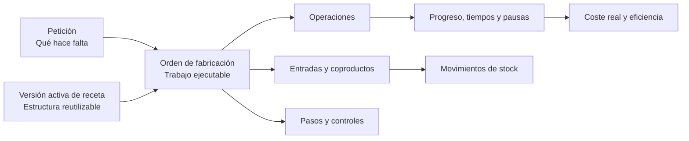

Una **orden de fabricación** es trabajo real que puede planificarse, ejecutarse, pausarse, completarse o cancelarse.

La orden nace desde una petición de fabricación. Puede copiar la estructura de una receta o crearse sin receta.

## Mapa de relaciones

## Petición frente a orden

| Concepto | Papel |
| --- | --- |
| Petición de fabricación | Necesidad de fabricar una cantidad antes de una fecha. |
| Orden de fabricación | Trabajo ejecutable con operaciones, entradas, pasos y controles. |
| Operación | Etapa concreta dentro de la orden. |
| Progreso | Cantidad completada, rechazada o pendiente. |

La petición responde a "qué hace falta". La orden responde a "cómo y cuándo se ejecuta". Consulta [Peticiones de fabricación](/es/conceptos/fabricacion/peticiones-de-fabricacion) para ver estados, origen y reglas de asignación.

<Tip>
  No confundas la orden con la receta. La receta es una definición reutilizable; la orden contiene el trabajo concreto y conserva sus propios registros de ejecución.
</Tip>

## Con receta o sin receta

| Forma de lanzamiento | Resultado |
| --- | --- |
| Con receta | La orden copia las operaciones, entradas, coproductos, pasos, controles, restricciones y condiciones aplicables de la versión activa. |
| Sin receta | La orden nace sin operaciones ni una estructura copiada de receta. |

Una orden sin receta puede representar trabajo excepcional o todavía no estandarizado. No queda preparada para ejecución mientras no tenga operaciones y planificación suficiente.

## Qué copia una orden con receta

| Desde la receta | En la orden |
| --- | --- |
| Operaciones | Operaciones ejecutables. |
| Entradas | Materiales previstos. |
| Coproductos | Salidas adicionales esperadas. |
| Pasos | Instrucciones de trabajo. |
| Controles | Inspecciones obligatorias en el momento configurado. |
| Restricciones | Precedencia entre operaciones. |
| Condiciones | Elementos aplicables a la variante fabricada. |

## Estado y trazabilidad

El estado de la orden se deriva de sus operaciones. Si las operaciones empiezan, pausan o finalizan, la orden refleja ese avance.

La cantidad planificada solo debería cambiar antes de empezar. Después, el historial de progreso, consumos y producción protege la trazabilidad.

| Estado | Cuándo aparece |
| --- | --- |
| **Pendiente de planificar** | La orden existe, pero todavía no está preparada para ejecución. |
| **Planificada** | Las operaciones tienen planificación suficiente para empezar cuando corresponda. |
| **En curso** | Alguna operación empezó. |
| **Pausada** | El trabajo está detenido temporalmente. |
| **Bloqueada** | La orden no puede avanzar hasta resolver una condición pendiente. |
| **Finalizada** | El trabajo terminó. |
| **Cancelada** | La orden ya no debe ejecutarse. |

Consulta [Estados de fabricación](/es/conceptos/fabricacion/estados-de-fabricacion) para comparar estados de órdenes, operaciones, grupos y planes.

### Ejemplo de lectura

Una petición de 100 unidades puede estar cubierta por dos órdenes de 60 y 40 unidades. Cada orden conserva su propia estructura, estado y progreso, mientras la petición expresa la necesidad total que ambas cubren.

## Relación con almacén y costes

| Registro de la orden | Efecto relacionado |
| --- | --- |
| Consumo de entradas | Reduce el stock de los materiales consumidos. |
| Producción | Aumenta el stock del artículo fabricado o de los coproductos. |
| Tiempos, consumos y cantidades reales | Alimentan el cálculo de costes y eficiencia. |

Si faltan registros de ejecución, el coste real será incompleto.

## Relacionado

- [Peticiones de fabricación](/es/conceptos/fabricacion/peticiones-de-fabricacion)
- [Recetas y versiones](/es/conceptos/fabricacion/recetas-y-versiones)
- [Estados de fabricación](/es/conceptos/fabricacion/estados-de-fabricacion)
- [Asignaciones y grupos de operaciones](/es/conceptos/fabricacion/asignaciones-y-grupos-de-operaciones)
- [Inspecciones y controles](/es/conceptos/fabricacion/inspecciones-y-controles)
- [Controles, consumos y pausas](/es/conceptos/fabricacion/controles-consumos-y-pausas)
- [Crear una OF sin pedido de venta](/es/ayuda/produccion/generar-peticiones-manualmente)
- [Ejecutar operaciones en planta](/es/ayuda/produccion/ejecutar-operaciones-en-planta)
