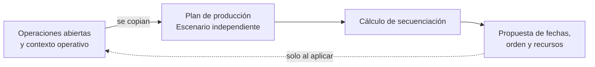

Un **plan de producción** es un escenario de planificación. Copia operaciones abiertas, recursos, restricciones, horario de fabricación, fechas y contexto de stock para calcular una propuesta de secuencia.

El plan no cambia la ejecución real hasta que lo aplicas.

## Modelo conceptual

| Concepto | Qué representa | Efecto sobre la ejecución real |
| --- | --- | --- |
| Secuenciación | Cálculo que ordena operaciones. | Ninguno por sí solo. |
| Plan de producción | Escenario que contiene un alcance y su contexto. | Ninguno mientras la propuesta permanezca en el plan. |
| Propuesta | Resultado calculado dentro del plan. | Ninguno hasta que se aplica. |
| Aplicación | Traslado de la propuesta a operaciones abiertas. | Actualiza la planificación de esas operaciones. |

## Para qué sirven

| Uso | Resultado |
| --- | --- |
| Evaluar capacidad | Ver si el trabajo cabe en recursos y franjas del horario disponibles. |
| Comparar alternativas | Probar fechas, prioridades o alcances antes de decidir. |
| Detectar bloqueos | Encontrar operaciones sin recurso, material o secuencia viable. |
| Aplicar una propuesta | Actualizar operaciones reales cuando el plan es ejecutable. |

## Partes del escenario

| Parte | Qué representa |
| --- | --- |
| Alcance | Fechas, órdenes y recursos incluidos. |
| Copia de contexto | Situación de operaciones, recursos, horario y materiales que conoce el plan. |
| Resolución | Cálculo de una propuesta de secuencia. |
| Resultado | Fechas, recursos, retrasos, bloqueos o datos faltantes detectados. |
| Aplicación | Relación que traslada la propuesta a operaciones reales abiertas. |

Los cambios posteriores en órdenes, recursos, horario o materiales no forman parte de una propuesta ya calculada. El plan y la ejecución real pueden representar momentos distintos.

## Estados del cálculo

| Estado | Significado |
| --- | --- |
| **Pendiente** | El plan está creado o actualizado, pero todavía no se está resolviendo. |
| **Procesando** | Bold está calculando una propuesta de secuencia. |
| **Solución encontrada** | Existe una propuesta revisable y aplicable. |
| **Fallido** | El cálculo no terminó correctamente. |
| **Sin solución factible** | No se encontró una secuencia válida con los datos y restricciones actuales. |

Consulta [Estados de fabricación](/es/conceptos/fabricacion/estados-de-fabricacion) para distinguir estados de planes y estados de ejecución real.

<Tip>
  **Solución encontrada** describe el resultado del cálculo. No significa que las operaciones reales estén **Planificadas** con esas fechas y recursos.
</Tip>

## Qué no modifica

Un plan no debe cambiar operaciones finalizadas ni canceladas. Tampoco sustituye los registros reales de ejecución. Su alcance es el trabajo abierto y la propuesta calculada para ese trabajo.

## Relación con planificación

Planificación responde qué falta y cuándo falta. El plan de producción responde cómo encajar el trabajo de fabricación en recursos y franjas horarias disponibles.

## Relacionado

- [Secuenciación](/es/conceptos/fabricacion/secuenciacion)
- [Estados de fabricación](/es/conceptos/fabricacion/estados-de-fabricacion)
- [Horario de fabricación](/es/conceptos/fabricacion/turnos)
- [Recursos](/es/conceptos/fabricacion/recursos)
- [Saber qué fabricar](/es/ayuda/planificacion/priorizar-necesidades)
- [Secuenciar órdenes](/es/ayuda/produccion/secuenciar-ordenes)
