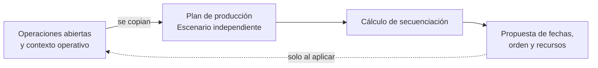

Un **plan de producción** es un escenario de planificación. Copia operaciones abiertas, recursos, restricciones, horario de fabricación, fechas y contexto de stock para calcular una propuesta de secuencia.

El plan no cambia la ejecución real hasta que lo aplicas.

## Modelo conceptual

| Concepto | Qué representa | Efecto sobre la ejecución real |
| --- | --- | --- |
| Secuenciación | Cálculo que ordena operaciones. | Ninguno por sí solo. |
| Plan de producción | Escenario que copia el trabajo abierto y su contexto. | Ninguno mientras la propuesta permanezca en el plan. |
| Propuesta | Resultado calculado dentro del plan. | Ninguno hasta que se aplica. |
| Aplicación | Traslado de la propuesta a operaciones abiertas. | Actualiza la planificación de esas operaciones. |

## Para qué sirven

| Uso | Resultado |
| --- | --- |
| Evaluar capacidad | Ver si el trabajo cabe en recursos y franjas del horario disponibles. |
| Comparar alternativas | Probar fechas y selecciones de recursos antes de decidir. |
| Detectar bloqueos | Encontrar operaciones sin recurso, material o secuencia viable. |
| Aplicar una propuesta | Actualizar operaciones reales cuando el plan es ejecutable. |

## Creación y actualización

Al crear un plan, Bold carga todas las operaciones y órdenes activas, las estaciones, las herramientas y el horario de fabricación. El horizonte comienza en el momento actual o en el inicio planificado más antiguo si es anterior, y abarca un año. No eliges un subconjunto de órdenes, fechas o recursos durante la creación.

| Opción | Efecto |
| --- | --- |
| Restringir según materias primas | Incluye la disponibilidad de materiales como restricción del cálculo. |
| Considerar empleados como factor limitante | Añade empleados como recursos del solver. No los asigna a las operaciones reales. |
| Solo crear | Crea y actualiza el escenario sin resolverlo. |
| Crear y resolver | Crea el escenario e inicia el cálculo. |
| Crear, resolver y aplicar | Crea, resuelve y aplica automáticamente la solución encontrada. |

Las dos opciones que resuelven permiten elegir el **modo de resolución** al crear el plan. En la aplicación se selecciona **Básico** inicialmente.

Actualizar el plan vuelve a copiar la realidad operativa actual. Los cambios posteriores en órdenes, recursos, horario o materiales no aparecen hasta que lo actualizas de nuevo.

## Resolver y aplicar

Resolver calcula una propuesta. También puedes pedir que se aplique automáticamente si el cálculo encuentra una solución.

| Modo | Cómo calcula la propuesta |
| --- | --- |
| **Básico** | Busca rápidamente una secuencia factible con una heurística. Si no logra completar la secuencia, el cálculo falla. |
| **Avanzado** | Usa la secuencia heurística como punto de partida y la refina con optimización matemática para mejorar el resultado. Puede tardar varios minutos. |

El diálogo **Resolver** selecciona **Básico** inicialmente. Si integras mediante la API y omites `mode` al crear y resolver un plan o al llamar a **Resolver**, el servidor utiliza **Avanzado**.

Al aplicar, Bold actualiza la fecha objetivo de las operaciones abiertas incluidas. En operaciones **Pendientes** o **Planificadas**, también actualiza la estación y la herramienta seleccionadas. No crea asignaciones de empleado ni modifica operaciones finalizadas o canceladas.

## Estados del cálculo

| Estado | Significado |
| --- | --- |
| **Pendiente** | El plan está creado o actualizado, pero todavía no se está resolviendo. |
| **Procesando** | Bold está calculando una propuesta de secuencia. |
| **Solución encontrada** | Existe una propuesta revisable y aplicable. |
| **Fallido** | El cálculo no terminó correctamente. |
| **Sin solución factible** | No se encontró una secuencia válida con los datos y restricciones actuales. |

Consulta [Estados de fabricación](/es/conceptos/fabricacion/estados-de-fabricacion) para distinguir estados de planes y estados de ejecución real.

<Tip>
  **Solución encontrada** describe el resultado del cálculo. No significa que las operaciones reales estén **Planificadas** con esas fechas y recursos.
</Tip>

## Qué no modifica

Un plan no cambia operaciones finalizadas ni canceladas y tampoco sustituye los registros reales de ejecución. Trabaja sobre la copia del trabajo abierto disponible cuando se creó o actualizó.

## Relación con planificación

Planificación responde qué falta y cuándo falta. El plan de producción responde cómo encajar el trabajo de fabricación en recursos y franjas horarias disponibles.

## Relacionado

- [Secuenciación](/es/conceptos/fabricacion/secuenciacion)
- [Estados de fabricación](/es/conceptos/fabricacion/estados-de-fabricacion)
- [Horario de fabricación](/es/conceptos/fabricacion/turnos)
- [Recursos](/es/conceptos/fabricacion/recursos)
- [Saber qué fabricar](/es/ayuda/planificacion/priorizar-necesidades)
- [Secuenciar órdenes](/es/ayuda/produccion/secuenciar-ordenes)
