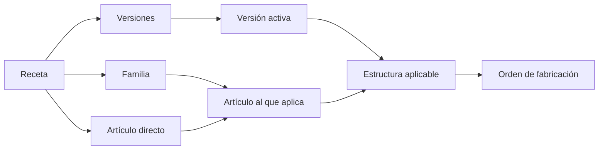

Una **receta** describe cómo fabricar uno o varios artículos. Define operaciones, entradas, coproductos, pasos, controles, restricciones y condiciones.

La receta no ejecuta trabajo. Sirve como molde para crear órdenes de fabricación con una estructura controlada.

## Mapa de relaciones



| Concepto | Qué representa | Relación con la ejecución |
| --- | --- | --- |
| Receta | Definición de cómo fabricar uno o varios artículos. | No ejecuta trabajo. |
| Versión | Estructura de la receta en un momento concreto. | La versión activa sirve de base para nuevas órdenes. |
| Aplicación | Relación entre la receta y una familia o artículo. | Determina para qué artículos puede evaluarse la receta. |
| Orden de fabricación | Trabajo ejecutable. | Copia los elementos aplicables de la versión activa. |

## Qué contiene una receta

| Elemento | Uso |
| --- | --- |
| Aplicación | Familias y artículos a los que puede aplicarse. |
| Versión | Estructura aprobada o editable de la receta. |
| Operaciones | Etapas ejecutables del proceso. |
| Entradas | Materiales o semielaborados que se consumen. |
| Coproductos | Salidas adicionales generadas. |
| Pasos | Instrucciones para operarios. |
| Controles | Comprobaciones obligatorias de calidad o proceso. |
| Restricciones | Precedencias entre operaciones. |
| Condiciones | Reglas que aplican según propiedades del artículo. |

## Aplicación a familias y artículos

Puedes vincular una receta de dos formas:

| Vínculo | Comportamiento |
| --- | --- |
| Familia | La receta se evalúa para los artículos de esa familia. Puedes añadir una condición basada en sus propiedades. |
| Artículo directo | La receta se evalúa para ese artículo aunque no llegue a él mediante su familia. Este vínculo no depende de la condición de familia. |

Si un artículo no cumple la condición de familia y no tiene un vínculo directo, la receta no se considera aplicable. Si falta una propiedad necesaria para evaluar la condición, la receta aparece como **Falta información**.

Un artículo puede tener varias recetas aplicables. Bold las ordena por prioridad y usa como receta principal la primera que esté **Lista**. La prioridad permite distinguir la receta preferente de las alternativas.

## Estado para un artículo

El estado se calcula para cada combinación de artículo y receta.

| Estado | Significado |
| --- | --- |
| **Lista** | La receta tiene una versión activa y el artículo aporta todas las propiedades necesarias. |
| **Falta información** | La receta puede aplicarse, pero faltan propiedades necesarias para evaluar condiciones o fórmulas. |
| **Inactiva** | La receta está vinculada al artículo, pero no tiene una versión activa. |

Bold identifica las propiedades que faltan. Mientras falten, la receta no está **Lista** para ese artículo.

## Versiones

Una versión conserva una estructura de fabricación en un momento concreto. Solo una versión debe estar activa para nuevas órdenes.

| Estado | Significado |
| --- | --- |
| Editable | Permite cambios estructurales. |
| Activa | Se usa para nuevas órdenes y protege la trazabilidad. |
| Inactiva | Se conserva como histórico o referencia. |

La versión **Activa** representa la estructura aprobada para nuevas órdenes. Las versiones **Inactivas** conservan estructuras anteriores como histórico o referencia.

## Condiciones y variantes

Las condiciones permiten que una misma receta se adapte a diferentes artículos de una familia.

| Condición | Decide |
| --- | --- |
| De familia | Si la receta se aplica a un artículo de la familia vinculada. |
| De operación | Si una etapa debe existir. |
| De entrada | Si se consume un material. |
| De paso | Si se muestra una instrucción. |

Ejemplo: una receta de mesa puede añadir una operación de pintura solo cuando la propiedad **Acabado** lo requiere.

Las condiciones solo pueden usar propiedades que afectan al artículo fabricado y están asignadas a la familia correspondiente.

<Tip>
  Una condición decide **si** un elemento forma parte de la estructura. Una fórmula calcula **qué valor** tendrá una cantidad, medida o instrucción.
</Tip>

## Fórmulas

Las fórmulas calculan la cantidad de las entradas y los coproductos, la duración de los pasos y los valores que se muestran en sus instrucciones.

Una fórmula puede combinar:

- números, con punto como separador decimal, como `0.15`;
- propiedades numéricas del artículo fabricado, como **Largo**;
- la **Cantidad de la OF**;
- sumas, restas, multiplicaciones, divisiones y paréntesis;
- las funciones de redondeo `round`, `ceil` y `floor`.

| Función | Resultado | Ejemplo |
| --- | --- | --- |
| `round(valor, múltiplo)` | Redondea al múltiplo más cercano. Los valores intermedios se redondean alejándose de cero. | `round(Largo * 0.35, 0.01)` deja dos decimales. |
| `ceil(valor, múltiplo)` | Redondea hacia arriba al siguiente múltiplo. | `ceil(Cantidad de la OF * 1.05, 12)` calcula cajas completas de 12. |
| `floor(valor, múltiplo)` | Redondea hacia abajo al múltiplo anterior. | `floor(Largo / 250)` cuenta las piezas enteras de 250 mm. |

El múltiplo es opcional, vale `1` por defecto y debe ser mayor que cero. Puede ser un número, una propiedad o una fórmula.

En el editor, escribe `@` o usa los botones **Propiedad** y **Dato de la orden** para insertar valores, y **Redondear** para añadir una función. Pulsa `Ctrl+Z` para deshacer cualquier cambio.

En las instrucciones, cada bloque de fórmula se sustituye por su resultado:

```text
Cortar material a [Largo]+7 mm
```

Si el artículo fabricado tiene `Largo = 100`, la orden mostrará `Cortar material a 107 mm`.

<Note>
  Si falta el valor de una propiedad o el múltiplo no es mayor que cero, Bold no puede calcular la fórmula. El cálculo de la receta falla y las instrucciones muestran la fórmula sin evaluar.
</Note>

## Edición y trazabilidad

Una versión activa queda protegida para conservar trazabilidad. Los cambios estructurales pertenecen a una versión editable distinta; la versión activa continúa representando la estructura aprobada con la que se crearon nuevas órdenes.

## Relacionado

- [Operaciones y restricciones](/es/conceptos/fabricacion/operaciones-y-restricciones)
- [Inspecciones y controles](/es/conceptos/fabricacion/inspecciones-y-controles)
- [Herramientas y características](/es/conceptos/fabricacion/herramientas-y-caracteristicas)
- [Procesos](/es/conceptos/fabricacion/procesos)
- [Peticiones de fabricación](/es/conceptos/fabricacion/peticiones-de-fabricacion)
- [Familia vs artículo](/es/conceptos/catalogo/familia-vs-articulo)
- [Crear una receta](/es/ayuda/produccion/crear-una-receta)
