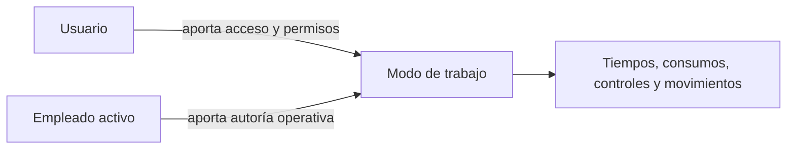

El **modo de trabajo** es la interfaz diaria para ejecutar tareas en planta. Está pensado para operarios que registran trabajo, stock, tiempos, controles o intervenciones desde un flujo más directo que la aplicación administrativa.

## Qué cambia frente a la aplicación normal

| Aplicación normal | Modo de trabajo |
| --- | --- |
| Configura datos, revisa listados y administra procesos. | Ejecuta tareas asignadas o disponibles. |
| Usa permisos de usuario. | Asocia la actividad con un empleado operativo. |
| Prioriza análisis y edición completa. | Prioriza escaneo, selección rápida y registro en planta. |
| Puede mostrar muchas áreas de la empresa. | Muestra flujos de producción, almacén y mantenimiento. |

El usuario controla el acceso. El empleado identifica quién realiza el trabajo operativo. Consulta [Empleados](/es/conceptos/personal/empleados) para ver la diferencia entre usuario y empleado.

## Áreas disponibles

| Área | Uso principal |
| --- | --- |
| Producción | Ver operaciones propias, iniciar, pausar, reanudar, registrar progreso, consumir materiales y completar controles. |
| Almacén | Ejecutar movimientos, inventarios, recepciones y órdenes de carga, y consultar stock o bultos. |
| Mantenimiento | Ejecutar partes de trabajo y registrar tiempos, acciones o materiales. |

El modo de trabajo no sustituye la configuración. Para crear recetas, ubicaciones, activos, turnos o permisos usa la aplicación normal.

## Empleado activo

El **empleado activo** es la identidad operativa a la que Bold asocia acciones, tiempos, tareas y registros.

Esto afecta a:

- trazabilidad de ejecución;
- registros de mano de obra;
- asignaciones de operaciones;
- costes reales;
- auditoría operativa.

<Tip>
  Una identidad de empleado por persona conserva la autoría de cada acción y evita mezclar tiempos o costes.
</Tip>

## Qué trabajo ve cada empleado

En producción, **Mis operaciones** organiza las tareas del empleado activo. La empresa configura uno de estos dos orígenes: **Habilidades** o **Puestos de trabajo habituales**. No combina ambos criterios a la vez.

| Criterio | Cómo afecta a la lista de trabajo |
| --- | --- |
| Habilidades | Muestra las operaciones cuyo proceso coincide con una habilidad del empleado. |
| Puestos de trabajo habituales | Muestra las operaciones planificadas en los puestos habituales del empleado. |

Las pestañas **Por estación**, **Por área**, **Por proceso** y **Buscar** son vías alternativas para localizar trabajo fuera de **Mis operaciones**. Las [habilidades y estaciones habituales](/es/conceptos/personal/habilidades-y-estaciones-habituales) ayudan a filtrar la lista, pero no sustituyen una asignación real.

## Registros de producción

Producción presenta operaciones y grupos como unidades de trabajo. Sus registros describen progreso, consumos, producción, controles, tiempos e interrupciones según la configuración de la orden.

Un [motivo de pausa](/es/conceptos/fabricacion/motivos-de-pausa-e-interrupciones) clasifica cada interrupción. La pausa conserva duración y contexto para que los cuadros de mando distingan ejecución y tiempo detenido.

## Entidades de almacén

El área de almacén separa cinco entradas operativas:

| Entrada | Uso |
| --- | --- |
| **Movimientos** | Recoger y entregar material entre ubicaciones con un equipo de almacén. |
| **Inventarios** | Contar existencias por ubicación y registrar lecturas. |
| **Recepciones** | Revisar y completar entradas de proveedor o cliente. |
| **Órdenes de carga** | Preparar, validar y completar cargas planificadas. |
| **Stock** | Consultar artículos, lotes, ubicaciones y bultos. |

Un [movimiento de almacén](/es/conceptos/almacen/movimientos-de-almacen) dirige el traslado físico. Una [orden de carga](/es/conceptos/almacen/ordenes-de-carga) coordina la mercancía que debe prepararse y expedirse.

## Escaneo y selección rápida

El modo de trabajo puede usar códigos QR o de barras para localizar empleados, operaciones, bultos, artículos, lotes, ubicaciones o documentos.

Usa etiquetas y códigos cuando el flujo dependa de identificar objetos físicos sin buscar en listas. Consulta [Diseños y etiquetas](/es/conceptos/panel-de-control/disenos-y-etiquetas) para la parte de impresión.

## Relación con otros conceptos

| Concepto | Relación |
| --- | --- |
| Operaciones | Son el trabajo productivo que se ejecuta en modo de trabajo. |
| Grupos de operaciones | Permiten ejecutar varias operaciones juntas cuando comparten contexto operativo. |
| Habilidades y estaciones habituales | Ayudan a mostrar tareas relevantes para el empleado activo. |
| Inspecciones y controles | Pueden bloquear inicio, progreso o cierre hasta registrar el resultado. |
| Motivos de pausa | Explican interrupciones durante operaciones o grupos. |
| Partes de trabajo | Se ejecutan desde mantenimiento y alimentan historial y costes. |

## Relacionado

- [Ejecutar operaciones en planta](/es/ayuda/produccion/ejecutar-operaciones-en-planta)
- [Habilidades y estaciones habituales](/es/conceptos/personal/habilidades-y-estaciones-habituales)
- [Asignaciones y grupos de operaciones](/es/conceptos/fabricacion/asignaciones-y-grupos-de-operaciones)
- [Inspecciones y controles](/es/conceptos/fabricacion/inspecciones-y-controles)
- [Motivos de pausa e interrupciones](/es/conceptos/fabricacion/motivos-de-pausa-e-interrupciones)
- [Movimientos de almacén](/es/conceptos/almacen/movimientos-de-almacen)
- [Órdenes de carga](/es/conceptos/almacen/ordenes-de-carga)
