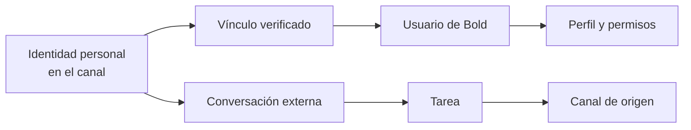

Una **identidad relacionada** vincula un usuario de Bold con su identidad personal en un canal de mensajería. Gracias a esa relación, Bold puede reconocer quién inicia una conversación fuera de la aplicación y aplicar los permisos de su usuario.

## Elementos del modelo

| Elemento | Qué representa |
| --- | --- |
| Canal | Medio externo desde el que se conversa con Bold, como Telegram. |
| Identidad personal | Cuenta que identifica a la persona dentro del canal. |
| Identidad relacionada | Vínculo verificado entre la identidad del canal y un usuario de Bold. |
| Usuario de Bold | Identidad que aporta el perfil y los permisos aplicables. |
| Canal de origen | Canal asociado a una tarea iniciada desde una conversación externa. |

Actualmente, Telegram puede actuar como canal cuando está habilitado para la empresa. El mismo modelo conceptual permite incorporar otros canales de mensajería en el futuro.

## Vínculo e identidad

El vínculo pertenece a una persona. La verificación se realiza mediante un enlace temporal generado por Bold y establece qué usuario corresponde a la identidad externa.

| Estado | Efecto conceptual |
| --- | --- |
| Sin vincular | Bold no relaciona la identidad del canal con un usuario. |
| Vinculada | La identidad externa se reconoce como el usuario asociado. |
| Desvinculada | La conversación con Boldy deja de estar disponible desde esa identidad hasta que se establezca un nuevo vínculo. |

<Warning>
  Una identidad externa es personal. Compartirla entre varios usuarios rompe la correspondencia entre la persona que conversa y los permisos aplicados.
</Warning>

## Relación con los permisos

La identidad relacionada no concede permisos propios ni amplía los del usuario. Solo permite trasladar la identidad ya verificada al canal externo.

| Pregunta | Concepto responsable |
| --- | --- |
| ¿Quién conversa desde el canal? | Identidad relacionada. |
| ¿Qué datos puede consultar? | Permisos del usuario. |
| ¿Qué acciones puede realizar? | Permisos del usuario y reglas del elemento. |
| ¿Dónde continúa la conversación? | Canal de origen de la tarea. |

## Tareas iniciadas desde un canal

Una tarea conserva su canal de origen. Su actividad y resultado pueden consultarse desde Bold, pero las aclaraciones y respuestas continúan en la conversación externa donde comenzó.

### Ejemplo ilustrativo

Laura vincula su identidad de Telegram con su usuario de Bold e inicia una tarea desde ese canal.

- Bold reconoce a Laura mediante la identidad relacionada.
- La tarea solo puede acceder a lo permitido por el perfil de Laura.
- La actividad y el resultado quedan visibles en Bold.
- Las aclaraciones de esa tarea permanecen en la conversación de Telegram que la originó.

El canal cambia el lugar de la conversación, no la identidad ni el alcance del acceso.

## Relacionado

- [Vincular Telegram](/es/ayuda/panel-de-control/vincular-telegram)
- [Tareas](/es/conceptos/smart-factory/tareas)
- [Usuarios, perfiles y permisos](/es/conceptos/panel-de-control/usuarios-roles-y-permisos)
