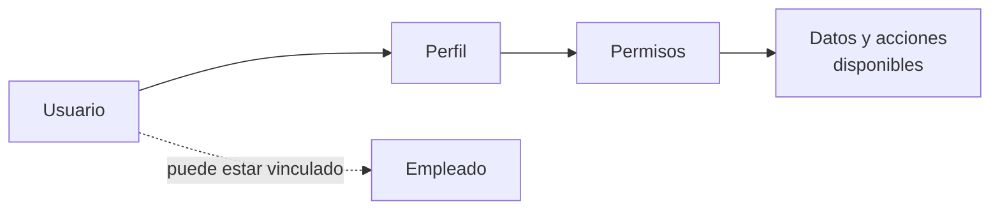

Un **usuario** accede a Bold. Un **perfil** agrupa permisos. Un **permiso** habilita una capacidad concreta. Juntos forman el modelo de acceso de las personas a la aplicación.

## Entidades

| Concepto | Qué representa | Qué no representa |
| --- | --- | --- |
| Usuario | Identidad con credenciales de acceso. | La actividad laboral de una persona. |
| Perfil | Conjunto reutilizable de permisos. | Un puesto de trabajo o una identidad individual. |
| Permiso | Capacidad concreta para consultar, editar o ejecutar una acción. | Una garantía de que la acción sea válida en cualquier estado. |
| Empleado | Persona operativa que registra trabajo, aunque no siempre tenga usuario. | Una cuenta con acceso a Bold. |

<Info>
  Usuario y empleado pueden estar vinculados, pero no son el mismo concepto. El usuario responde a «quién entra y qué puede hacer». El empleado responde a «quién trabaja, registra tiempo o participa en costes».
</Info>

## Tipos de capacidad

Los permisos distinguen capacidades con efectos diferentes:

| Capacidad | Qué permite |
| --- | --- |
| Consulta | Ver datos. |
| Edición | Crear o modificar registros y, según el módulo, completarlos o cancelarlos. |
| Ejecución | Realizar acciones operativas específicas, como trabajar en planta, secuenciar órdenes o activar versiones. |

Un permiso define acceso, pero no elimina las reglas del dato. Por ejemplo, el estado de un documento puede impedir una acción aunque el usuario disponga del permiso correspondiente.

## Perfiles por responsabilidad

Los perfiles representan responsabilidades reutilizables. No necesitan reproducir a cada persona de la empresa.

| Perfil típico | Alcance habitual |
| --- | --- |
| Administración | Configuración, usuarios y datos maestros. |
| Almacén | Stock, recepciones, movimientos e inventarios. |
| Producción | Órdenes, operaciones, consumos y progreso. |
| Mantenimiento | Activos, preventivos y partes. |
| Consulta | Lectura sin cambios operativos. |

<Warning>
  Los permisos de escritura pueden cambiar stock, costes o trazabilidad. Los perfiles temporales o externos no deberían incluir capacidades ajenas a su responsabilidad.
</Warning>

## Permisos por módulo

| Módulo | Datos y acciones habituales |
| --- | --- |
| Acceso común | Entrada a Bold, modo administrativo y modo de trabajo. |
| Catálogo | Familias, propiedades y artículos. |
| Almacén | Ubicaciones, recepciones, envíos, inventarios, movimientos y bultos. |
| Planificación | Clientes, proveedores, pedidos, recomendaciones y artículos planificables. |
| Producción | Recetas, órdenes, peticiones, estaciones y secuenciación. |
| Mantenimiento | Activos, causas, acciones, partes y preventivos. |
| Personal | Usuarios, empleados, jornadas, calendarios, turnos y tareas. |
| Archivos y etiquetas | Archivos adjuntos, evidencias, diseños y plantillas. |
| Smart Factory | Informes, Boldy, tareas y automatizaciones. |

Algunas capacidades combinan más de un módulo. Por ejemplo, subir una evidencia puede requerir acceso a archivos además del permiso sobre el elemento funcional.

Administrar usuarios, perfiles y permisos requiere un perfil de administración de la aplicación. No es un permiso operativo de personal.

## Ejemplo ilustrativo

Marta puede ser a la vez usuaria y empleada:

| Dimensión | Ejemplo |
| --- | --- |
| Usuario | Entra en Bold con sus credenciales. |
| Perfil | Tiene el perfil **Responsable de producción**. |
| Permisos | Puede consultar y actualizar órdenes de fabricación. |
| Empleado | Registra tiempo en operaciones y participa en el cálculo de costes. |

Si solo necesitara registrar trabajo desde una identidad operativa, podría existir como empleada sin disponer de un usuario con acceso administrativo.

## Acceso de integraciones y automatizaciones

| Identidad | Modelo de acceso |
| --- | --- |
| Usuario | Recibe permisos mediante un perfil. |
| Clave de integración | No usa perfiles ni permite configurar alcances. Actualmente tiene acceso administrativo amplio al tenant. |
| Automatización | Actúa con permisos delegados para completar su trabajo. |

Estas identidades no son intercambiables. Consulta [Claves de integración y avisos externos](/es/conceptos/panel-de-control/claves-de-integracion-y-avisos-externos) para conocer el alcance de las credenciales técnicas.

## Relacionado

- [Panel de control](/es/conceptos/panel-de-control)
- [Empleados](/es/conceptos/personal/empleados)
- [Claves de integración y avisos externos](/es/conceptos/panel-de-control/claves-de-integracion-y-avisos-externos)
- [Automatizaciones](/es/conceptos/smart-factory/automatizaciones)
- [Invitar usuarios](/es/ayuda/usuarios-y-permisos/invitar-usuarios)
