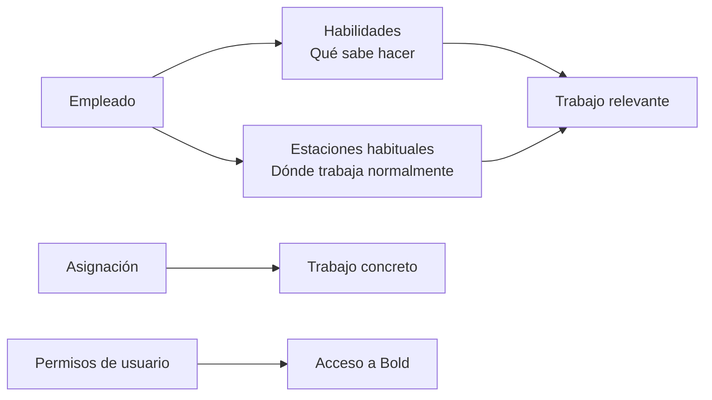

Las **habilidades** y las **estaciones habituales** describen qué trabajo suele poder hacer un empleado y dónde trabaja normalmente. Ayudan a determinar qué trabajo es relevante para esa persona, pero no lo asignan ni confirman su disponibilidad.

## Diferencias clave

| Concepto | Pregunta que responde | Alcance |
| --- | --- | --- |
| Habilidad | ¿Qué tipo de trabajo puede realizar? | Un proceso o tipo de operación. |
| Estación habitual | ¿Dónde trabaja normalmente? | Una estación de trabajo. |
| Asignación | ¿Qué trabajo concreto tiene preparado? | Una operación o grupo determinado. |
| Disponibilidad | ¿Cuándo se espera que trabaje? | Periodos calculados a partir de horarios. |
| Permiso de usuario | ¿A qué datos y acciones puede acceder? | Módulos y acciones de la aplicación. |

<Info>
  Las habilidades y estaciones habituales orientan la relevancia del trabajo. No sustituyen una asignación, un horario ni los permisos de acceso.
</Info>

Un empleado puede tener habilidades sin disponer de un usuario. También puede tener usuario sin estar configurado para trabajo operativo.

## Habilidades

Una habilidad se basa en un [proceso](/es/conceptos/fabricacion/procesos). Por ejemplo, un empleado puede estar habilitado para **Corte**, **Montaje** o **Inspección final**.

Las habilidades permiten relacionar empleados con operaciones compatibles con su capacidad. También ayudan a analizar qué personas cubren cada tipo de trabajo.

Una habilidad expresa capacidad operativa. No garantiza que el empleado esté disponible ni que tenga una operación asignada.

## Estaciones habituales

Una estación habitual indica dónde trabaja normalmente una persona. Permite dar relevancia al trabajo de su puesto o célula, aunque no limita su actividad a esa ubicación.

La estación habitual y la estación de ejecución tampoco son equivalentes: la primera expresa una preferencia estable; la segunda pertenece a la operación concreta.

## Ejemplo ilustrativo

Ana tiene la habilidad **Soldadura** y la estación habitual **Célula 2**.

| Dato | Qué permite interpretar |
| --- | --- |
| Habilidad Soldadura | Las operaciones del proceso Soldadura son compatibles con su capacidad. |
| Estación habitual Célula 2 | El trabajo de esa célula es especialmente relevante para Ana. |
| Operación asignada en Célula 4 | Existe un trabajo concreto para Ana fuera de su estación habitual. |
| Turno de tarde | Indica cuándo se espera que esté disponible. |
| Permisos de producción | Determinan qué puede consultar o modificar en Bold. |

Estos datos se complementan. Ninguno permite deducir por sí solo los demás.

## Relación con el modo de trabajo

El [modo de trabajo](/es/conceptos/modo-de-trabajo) puede combinar varias señales para presentar trabajo relevante:

| Señal | Aportación |
| --- | --- |
| Habilidades | Compatibilidad con el proceso. |
| Estaciones habituales | Afinidad con el puesto o la zona. |
| Operaciones asignadas | Relación directa con un trabajo concreto. |
| Grupos de operaciones | Pertenencia a un bloque de trabajo compartido. |
| Operaciones activas o recientes | Continuidad del trabajo iniciado. |

<Tip>
  Un nivel de detalle coherente con la organización real de la planta hace que habilidades y estaciones habituales distingan mejor el trabajo relevante.
</Tip>

## Relacionado

- [Empleados](/es/conceptos/personal/empleados)
- [Modo de trabajo](/es/conceptos/modo-de-trabajo)
- [Procesos](/es/conceptos/fabricacion/procesos)
- [Recursos](/es/conceptos/fabricacion/recursos)
- [Asignaciones y grupos de operaciones](/es/conceptos/fabricacion/asignaciones-y-grupos-de-operaciones)
