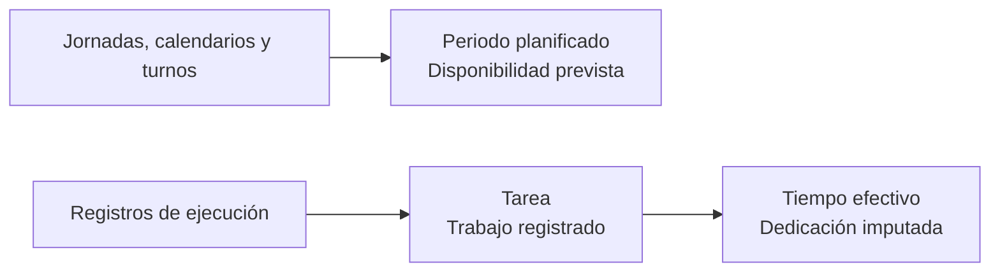

Bold distingue entre **disponibilidad planificada** y **trabajo ejecutado**. Los periodos planificados indican cuándo se espera que trabaje un empleado. Las tareas recogen intervalos procedentes de la ejecución real.

## Diferencias clave

| Concepto | Qué representa | Qué no demuestra |
| --- | --- | --- |
| Periodo planificado | Tramo fechado en el que se espera que trabaje un empleado. | Que el empleado haya asistido o trabajado. |
| Tarea | Intervalo de ejecución relacionado con producción, mantenimiento o almacén. | Que ese trabajo estuviera previsto en su horario. |
| Tiempo efectivo | Parte de una tarea imputada al empleado después de repartir posibles solapes. | Tiempo adicional cuando existen tareas simultáneas. |

<Info>
  Un periodo planificado describe disponibilidad prevista. No es un registro de presencia.
</Info>

## Origen de los periodos planificados

Bold convierte jornadas, calendarios y turnos en periodos fechados dentro de la zona horaria del empleado. Cuando coinciden varias reglas para una fecha, prevalece la más específica.

| Prioridad | Fuente | Qué representa |
| --- | --- | --- |
| 1 | Asignación manual | Una excepción directa para el empleado y la fecha. |
| 2 | Calendario local | Una excepción compartida, como un festivo o una jornada especial. |
| 3 | Turno | El patrón repetitivo de trabajo. |

Si ninguna fuente aporta una jornada, no existe un periodo planificado para ese día.

## Origen de las tareas

Las tareas se derivan de registros de ejecución:

- asignaciones y tiempos de operaciones de fabricación;
- tiempos de partes de mantenimiento;
- ejecuciones de órdenes de carga;
- movimientos de almacén.

Cada tarea conserva el empleado, el tipo de trabajo, el elemento relacionado y sus instantes de inicio y fin. Una tarea no representa una asignación futura ni sustituye la planificación del empleado.

## Tareas simultáneas

Si varias tareas se solapan, Bold reparte la dedicación del intervalo compartido. Así, una misma hora no se contabiliza como una hora completa en cada tarea.

### Ejemplo ilustrativo

Un empleado tiene un periodo planificado de **08:00 a 16:00**. Registra una tarea de montaje de **09:00 a 11:00** y otra tarea de inspección de **10:00 a 12:00**.

| Intervalo | Situación | Interpretación |
| --- | --- | --- |
| 08:00–09:00 | Periodo planificado sin tarea | Disponibilidad prevista sin ejecución registrada. |
| 09:00–10:00 | Solo montaje | La dedicación corresponde al montaje. |
| 10:00–11:00 | Montaje e inspección | La dedicación se reparte entre las dos tareas. |
| 11:00–12:00 | Solo inspección | La dedicación corresponde a la inspección. |
| 12:00–16:00 | Periodo planificado sin tarea | Disponibilidad prevista sin ejecución registrada. |

El ejemplo permite comparar planificación y ejecución, pero no acredita presencia durante los intervalos sin tareas.

## Qué responde cada dato

| Pregunta | Fuente |
| --- | --- |
| ¿Cuándo estaba previsto que trabajara el empleado? | Periodos planificados. |
| ¿Qué trabajo se registró y cuándo? | Tareas. |
| ¿Cuánto tiempo se imputa después de considerar solapes? | Tiempo efectivo de las tareas. |

## Relacionado

- [Empleados](/es/conceptos/personal/empleados)
- [Jornadas, calendarios y turnos](/es/conceptos/personal/jornadas-calendarios-y-turnos)
- [Asignaciones y grupos de operaciones](/es/conceptos/fabricacion/asignaciones-y-grupos-de-operaciones)
- [Partes de trabajo](/es/conceptos/mantenimiento/partes-de-trabajo)
