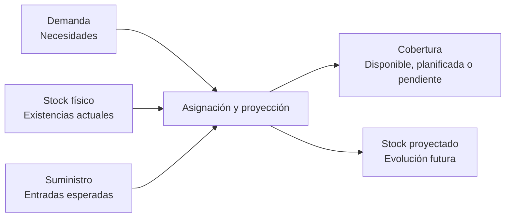

La planificación compara **demanda**, **suministro** y **stock** para decidir qué falta, cuándo falta y cómo cubrirlo.

La demanda indica necesidades. El suministro indica entradas esperadas. La [asignación de demanda y suministro](/es/conceptos/planificacion/asignacion-de-demanda-y-suministro) explica qué parte de cada necesidad queda cubierta por stock actual o por entradas futuras.

## Cómo se relacionan



<Note>
  No confundas el suministro con el stock físico. El suministro representa una entrada esperada; solo se convierte en stock cuando se recibe el material o se completa la fabricación.
</Note>

## Conceptos

| Concepto | Significado |
| --- | --- |
| Demanda | Necesidad de stock generada por una venta confirmada o un consumo previsto de fabricación. |
| Suministro | Entrada esperada por una compra confirmada o por fabricación. |
| Asignación | Relación calculada entre una necesidad y el stock o suministro que la cubre. |
| Stock proyectado | Evolución futura al aplicar demanda y suministro. |
| Contra pedido | Cobertura directa de una necesidad concreta. |
| Contra stock | Cobertura agrupada desde inventario común y entradas compartidas. |
| Punto de pedido | Umbral desde el que conviene reponer. |
| Pedido mínimo | Cantidad mínima recomendada. |
| Tamaño de lote | Múltiplo operativo para redondear cantidades. |

## Demanda

La demanda puede venir de pedidos de venta confirmados, necesidades internas o consumos previstos de fabricación.

| Origen | Cuándo genera demanda |
| --- | --- |
| Pedido de venta | Cuando la línea está confirmada y queda cantidad pendiente de entregar. |
| Orden o petición de fabricación | Cuando necesita componentes o material para ejecutarse. |
| Consumo previsto | Cuando una operación abierta espera consumir material. |

Una línea de venta en borrador no genera demanda. Solo las líneas confirmadas representan compromisos que entran en planificación.

## Suministro

El suministro puede venir de pedidos de compra confirmados, recepciones pendientes, peticiones de fabricación u órdenes planificadas.

| Origen | Cuándo genera suministro |
| --- | --- |
| Pedido de compra | Cuando la línea está confirmada y queda cantidad pendiente de recibir. |
| Petición de fabricación | Cuando representa una necesidad de fabricar antes de una fecha. |
| Orden de fabricación | Cuando la producción pendiente debe aumentar stock. |

Cuando almacén recibe material o producción completa una orden, el suministro pendiente se transforma en stock físico.

<Info>
  Una previsión es una recomendación. No es demanda, suministro ni stock entrante, y no cubre ninguna necesidad hasta que la conviertes en un pedido de compra o una petición de fabricación que entre en planificación.
</Info>

## Stock proyectado

```text
Stock disponible actual = stock físico - stock saliente
Stock disponible proyectado = stock disponible actual + stock entrante
```

El proyectado permite detectar faltas antes de que el stock físico sea negativo.

<Info>
  El stock físico describe lo que existe ahora. El stock proyectado incorpora compromisos futuros y puede anticipar una falta aunque todavía haya unidades en almacén.
</Info>

Las [previsiones y asistentes](/es/conceptos/planificacion/previsiones-y-asistentes) usan este cálculo para sugerir compras o fabricaciones antes de crear documentos.

## Estados de cobertura

| Estado | Significado |
| --- | --- |
| **Disponible** | Hay stock suficiente ahora. |
| **Planificado** | La necesidad queda cubierta por suministro futuro. |
| **Parcialmente planificado** | Solo una parte queda cubierta. |
| **Pendiente** | Falta crear o confirmar suministro suficiente. |
| **No requerido** | La necesidad no requiere aprovisionamiento. |

Consulta [Asignación de demanda y suministro](/es/conceptos/planificacion/asignacion-de-demanda-y-suministro) para ver cómo se decide cada estado.

## Ejemplo

Tienes 20 unidades de un artículo. Hay una venta confirmada de 35 unidades y una compra confirmada de 30 unidades que llega antes de la fecha de entrega.

| Momento | Elemento | Variación | Stock proyectado |
| --- | --- | ---: | ---: |
| Hoy | Stock físico inicial | 20 | 20 |
| Antes de la entrega | Suministro de la compra | +30 | 50 |
| En la fecha de entrega | Demanda de la venta | -35 | 15 |

Aunque el stock físico actual sea 20, la venta queda cubierta si la compra llega a tiempo. Después de cubrir las 35 unidades quedan 15 unidades proyectadas.

## Relacionado

- [Planificación](/es/conceptos/planificacion)
- [Asignación de demanda y suministro](/es/conceptos/planificacion/asignacion-de-demanda-y-suministro)
- [Previsiones y asistentes](/es/conceptos/planificacion/previsiones-y-asistentes)
- [Stock y movimientos](/es/conceptos/almacen/stock-y-movimientos)
- [Saber qué comprar](/es/ayuda/planificacion/asistente-de-compras)
- [Saber qué fabricar](/es/ayuda/planificacion/priorizar-necesidades)
