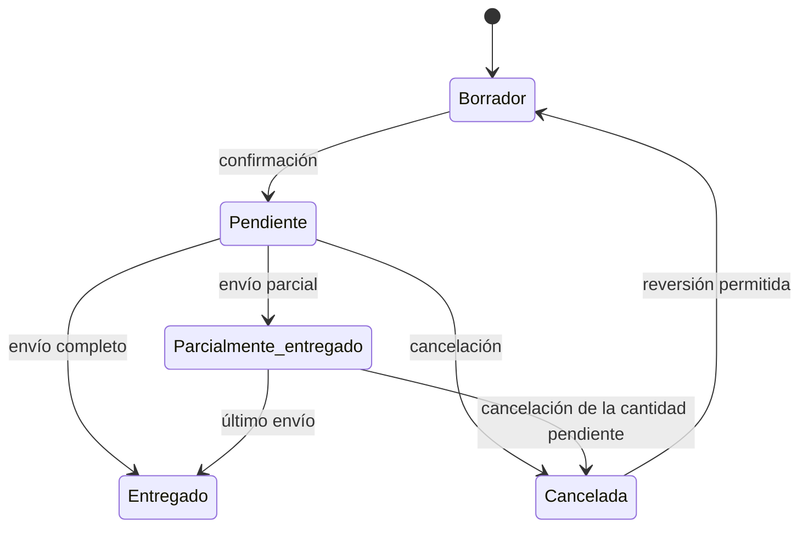

Un **pedido de venta** representa un compromiso con un cliente. Sus líneas generan demanda solo cuando están confirmadas.

La cabecera identifica el cliente, el código del pedido, fechas, notas y referencias externas. Las líneas indican qué artículo se necesita, en qué cantidad, con qué fecha objetivo y en qué estado está la entrega.

## Cabecera y líneas

| Parte | Qué contiene | Para qué sirve |
| --- | --- | --- |
| Cabecera | Cliente, código, nombre, fecha de pedido, notas y referencia externa. | Agrupa el compromiso comercial y lo conecta con integraciones. |
| Línea | Artículo, cantidad, fechas, modo de cumplimiento, estado y cantidades entregadas o pendientes. | Genera demanda y permite seguir cada entrega. |

Un pedido puede tener varias líneas. Usa líneas separadas cuando cambian el artículo, la cantidad, la fecha esperada o el modo de cumplimiento.

## Qué es una línea de pedido de venta

Una línea es la unidad que planificación puede cubrir. No basta con que exista el pedido: la demanda nace en la línea cuando la confirmas.

| Campo | Uso |
| --- | --- |
| Artículo | Variante exacta que el cliente necesita. |
| Cantidad solicitada | Cantidad total comprometida con el cliente. |
| Cantidad enviada | Parte ya expedida mediante envíos. |
| Cantidad cancelada | Parte retirada del compromiso. |
| Cantidad pendiente | Cantidad que sigue generando demanda. |
| Fecha solicitada | Fecha pedida por el cliente. |
| Fecha comprometida | Fecha que te comprometes a cumplir si existe. |
| Fecha objetivo | Fecha que usa planificación para cubrir la línea. |
| Modo de cumplimiento | Indica si la línea se cubre **Contra pedido** o **Contra stock**. |
| Disponibilidad | Muestra si la línea está cubierta por stock actual o suministro planificado. |

## Ciclo de vida de una línea

| Estado | Efecto en planificación | Qué significa |
| --- | --- | --- |
| **Borrador no confirmado** | No genera demanda. | Puedes ajustar artículo, cantidad y modo de cumplimiento antes de comprometer la línea. |
| **Pendiente** | Genera demanda por la cantidad pendiente. | La línea está confirmada y falta entregarla. |
| **Parcialmente entregado** | Genera demanda solo por la parte pendiente. | Ya hubo uno o varios envíos, pero queda cantidad por entregar. |
| **Entregado** | No genera demanda pendiente. | La cantidad abierta quedó expedida. |
| **Cancelada** | No genera demanda. | La cantidad abierta queda retirada del compromiso. |

El estado del pedido se deriva de los estados de sus líneas.

El diagrama resume las transiciones principales. Las entregas parciales y las cancelaciones conservan las cantidades ya enviadas como histórico.

## Hechos que cambian una línea

| Hecho | Efecto en el modelo |
| --- | --- |
| Confirmación | La línea pasa de borrador a pendiente y empieza a generar demanda. |
| Cambio de fechas | La fecha objetivo se recalcula y actualiza la referencia temporal de planificación. |
| Envío | Aumenta la cantidad enviada y reduce la demanda pendiente. |
| Cancelación de cantidad pendiente | Retira la cantidad abierta del compromiso. |
| Reversión de una cancelación | Devuelve la línea a borrador cuando las reglas lo permiten. |

## Reglas del modelo

- Confirmar una línea exige un artículo activo y solo puede hacerse desde borrador.
- Artículo, cantidad y modo de cumplimiento se editan solo mientras la línea está en borrador.
- Fechas y notas pueden cambiar después de confirmar para mantener la planificación actualizada.
- No puedes eliminar ni cancelar como si no existiera una línea ya entregada o parcialmente entregada.
- Si cancelas cantidad pendiente después de una entrega parcial, Bold conserva la parte enviada como histórico.
- La fecha objetivo usa la fecha comprometida si existe. Si no existe, usa la fecha solicitada o la fecha del pedido más el plazo del artículo.

<Info>
  El pedido de venta explica el compromiso con cliente. El envío explica la salida física que reduce stock.
</Info>

## Relación con planificación y almacén

Una línea confirmada aumenta el stock saliente por su cantidad pendiente. Cuando almacén registra un envío, Bold reduce esa demanda pendiente y actualiza el estado de la línea.

La disponibilidad de la línea se calcula aparte del estado de entrega. Una línea puede estar pendiente y, aun así, tener suministro planificado.

<Note>
  No confundas el estado de entrega con la disponibilidad. El primero indica qué parte ya se envió; la segunda indica si stock o suministro futuro cubren lo que queda pendiente.
</Note>

### Ejemplo de las dos lecturas

Una línea solicita 50 unidades y ya se han enviado 20. Las 30 restantes están cubiertas por una compra confirmada que llegará a tiempo.

| Lectura | Resultado | Motivo |
| --- | --- | --- |
| Estado de entrega | **Parcialmente entregado** | Ya se enviaron 20 de 50 unidades. |
| Demanda pendiente | **30 unidades** | Es la parte que todavía no se ha enviado ni cancelado. |
| Disponibilidad | **Planificada** | Un suministro futuro cubre las 30 unidades pendientes. |

El suministro planificado no cambia el estado de entrega. La línea seguirá parcialmente entregada hasta que un envío reduzca la cantidad pendiente.

## Permisos

| Acción | Permiso necesario |
| --- | --- |
| Ver pedidos de venta | Acceso de lectura a ventas. |
| Crear, editar, confirmar o cancelar pedidos de venta | Acceso de edición a ventas. |

## Relacionado

- [Clientes](/es/conceptos/planificacion/clientes)
- [Demanda y suministro](/es/conceptos/planificacion/demanda-y-suministro)
- [Envíos](/es/conceptos/almacen/envios)
- [Crear un pedido de venta](/es/ayuda/ventas/introduccion)
- [Preparar y registrar un envío](/es/ayuda/ventas/preparar-y-registrar-envio)
