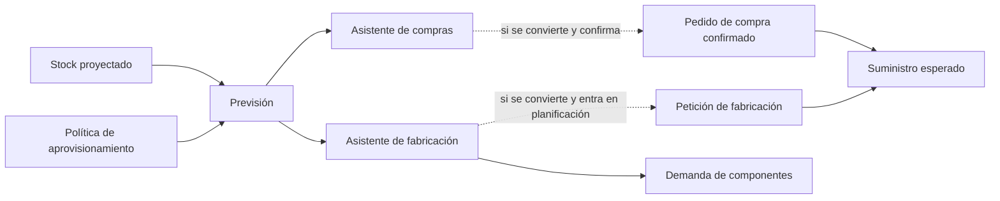

Las **previsiones** son necesidades sugeridas por Bold antes de crear documentos operativos. Ayudan a decidir qué comprar o fabricar, cuándo hacerlo y en qué cantidad.

Los asistentes muestran esas sugerencias para que las revises antes de convertirlas en pedidos de compra o peticiones de fabricación.

<Note>
  No confundas una previsión con un compromiso. La previsión propone una cobertura; un documento confirmado representa suministro esperado.
</Note>

## Tipos de previsión

| Tipo | Resultado esperado |
| --- | --- |
| Previsión de compra | Puede convertirse en un [pedido de compra](/es/conceptos/planificacion/pedidos-de-compra). |
| Previsión de fabricación | Puede convertirse en una [petición de fabricación](/es/conceptos/fabricacion/peticiones-de-fabricacion). |

La previsión no cambia el stock y no cuenta como suministro del artículo previsto. En una previsión de fabricación, Bold calcula las entradas de la receta y puede generar desde ese momento demanda de componentes. Al convertir la previsión en una petición u orden, el producto fabricado pasa a formar parte del suministro esperado.

## Modelo de relación

## Qué datos usa Bold

Bold compara stock, demanda, suministro y la política de aprovisionamiento del artículo.

| Dato | Efecto |
| --- | --- |
| Stock actual | Punto de partida físico. |
| Stock saliente | Compromisos de venta o consumo que reducen disponibilidad. |
| Stock entrante | Compras confirmadas y fabricación que aumentan la disponibilidad futura. |
| Punto de pedido | Umbral que dispara una recomendación contra stock. |
| Pedido mínimo | Cantidad mínima sugerida al reponer. |
| Tamaño de lote | Múltiplo usado para redondear cantidades. |
| Proveedor preferente | Fuente propuesta para compras. |
| Plazo de entrega o fabricación | Fecha desde la que conviene lanzar el aprovisionamiento. |

Consulta [Demanda y suministro](/es/conceptos/planificacion/demanda-y-suministro) para entender cómo se calcula el stock proyectado.

## Comparación de asistentes

| Aspecto | Asistente de compras | Asistente de fabricación |
| --- | --- | --- |
| Artículos incluidos | Configurados para aprovisionarse por compra. | Configurados para aprovisionarse por fabricación. |
| Organización principal | Necesidades agrupadas por proveedor. | Necesidades agrupadas por periodo. |
| Contexto que muestra | Cantidades que conviene comprar y proveedor propuesto. | Demanda urgente o futura que conviene fabricar. |
| Documento resultante | [Pedido de compra](/es/conceptos/planificacion/pedidos-de-compra). | [Petición de fabricación](/es/conceptos/fabricacion/peticiones-de-fabricacion). |
| Efecto antes de convertir | No genera suministro. | No genera suministro del producto; puede generar demanda de componentes. |

Una línea confirmada de pedido de compra genera suministro esperado. En fabricación, la previsión puede convertirse en una petición y después dar lugar a una o varias órdenes de fabricación.

## Ejemplo conceptual

Dos artículos tienen una necesidad sin cobertura de 20 unidades. El primero se aprovisiona por compra y el segundo por fabricación. En este ejemplo, ningún pedido mínimo ni tamaño de lote modifica la cantidad sugerida.

| Artículo | Origen configurado | Previsión | Efecto inmediato en el suministro |
| --- | --- | --- | --- |
| Materia prima A | Compra | Previsión de compra de 20 unidades. | Ninguno. |
| Producto B | Fabricación | Previsión de fabricación de 20 unidades. | No genera suministro del producto; sus entradas pueden generar demanda. |

La misma cantidad descubierta produce sugerencias distintas según el origen de aprovisionamiento. En ambos casos, la previsión sigue siendo una recomendación y no cubre la demanda por sí sola.

## Relación con la política de aprovisionamiento

Consulta [Política de aprovisionamiento](/es/conceptos/planificacion/politica-de-aprovisionamiento) para ver cómo configurar origen, modo, cantidades, plazos y proveedor principal.

| Configuración del artículo | Qué decide |
| --- | --- |
| Origen de aprovisionamiento | Si Bold recomienda comprar, fabricar o ignorar el artículo. |
| Modo de aprovisionamiento | Si cubre necesidades contra pedido o contra stock. |
| Punto de pedido | Cuándo aparece una recomendación contra stock. |
| Pedido mínimo | Cantidad mínima sugerida. |
| Tamaño de lote | Redondeo de la cantidad sugerida. |

## Relacionado

- [Planificación](/es/conceptos/planificacion)
- [Política de aprovisionamiento](/es/conceptos/planificacion/politica-de-aprovisionamiento)
- [Pedidos de compra](/es/conceptos/planificacion/pedidos-de-compra)
- [Peticiones de fabricación](/es/conceptos/fabricacion/peticiones-de-fabricacion)
- [Saber qué comprar](/es/ayuda/planificacion/asistente-de-compras)
- [Saber qué fabricar](/es/ayuda/planificacion/priorizar-necesidades)
